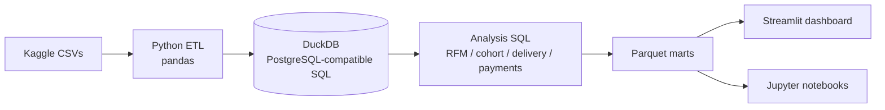

# Olist E-Commerce Analytics — End-to-End Data Pipeline

A full data-analyst pipeline on 100k real Brazilian e-commerce orders — Python ETL, SQL analysis in DuckDB, hypothesis testing, and an interactive Streamlit dashboard.

**Live dashboard:** _coming soon_

---

## Key Findings

- **Late deliveries hurt reviews — a lot.** Average review score drops from **4.29 (on-time)** to **2.27 (late)**, with a bad-review rate (1–2 stars) of **9% vs. 62%**. Mann-Whitney U test: **p ≈ 0**, effect size **r = 0.64 (large)** — the difference is both statistically and practically significant.
- **Credit card dominates payments**: **74% of transactions** and **78% of revenue**. The `computers` category has the highest average installment count at **7.3**.
- **Delivery estimates are conservative**: orders arrive **13.5 days early** on average, and only **6.8%** are late — by an average of **10.6 days** when they are.
- **Repeat purchases are rare.** Cohort analysis shows a low repeat-purchase base across nearly every acquisition cohort — most customers buy exactly once.

---

## Architecture



Raw Olist CSVs are extracted and cleaned with pandas, loaded into a local **DuckDB** database (queried with standard PostgreSQL-compatible SQL), analyzed with hand-written SQL for RFM segmentation, cohort retention, delivery performance, and payment behavior, then exported as **parquet marts** consumed by both the Streamlit dashboard and the Jupyter notebooks.

---

## Tech Stack

Python (pandas, pyarrow) · DuckDB · SQL · Streamlit · Plotly · SciPy (hypothesis testing) · Jupyter

## Repo Structure

```
ecommerce-analytics/
├── data/
│   ├── raw/            # Olist CSVs (downloaded, not committed)
│   └── processed/      # exported parquet marts
├── etl/
│   ├── extract.py      # load raw CSVs
│   ├── transform.py    # cleaning / joins
│   ├── load.py         # load into DuckDB
│   ├── run_pipeline.py # ETL entry point
│   └── export_marts.py # export analysis results to parquet
├── sql/
│   └── analysis/
│       ├── rfm_segmentation.sql
│       ├── cohort_retention.sql
│       ├── delivery_performance.sql
│       ├── payment_behavior.sql
│       └── sales_overview.sql
├── notebooks/
│   ├── 01_eda.ipynb
│   └── 02_statistical_analysis.ipynb
├── dashboard/
│   ├── app.py
│   └── pages/
└── docs/
    └── screenshots/
```

### Example: RFM Scoring (`sql/analysis/rfm_segmentation.sql`)

RFM is computed at the *person* level (`customer_unique_id`, not `customer_id` — Olist mints a new `customer_id` per order) and scored 1–5 per dimension with `NTILE(5)`:

```sql
scored AS (
    SELECT
        customer_unique_id,
        recency_days,
        frequency,
        ROUND(monetary, 2) AS monetary,
        -- recency: fewer days since last purchase = better = higher score
        NTILE(5) OVER (ORDER BY recency_days DESC) AS r_score,
        NTILE(5) OVER (ORDER BY frequency ASC)     AS f_score,
        NTILE(5) OVER (ORDER BY monetary ASC)      AS m_score
    FROM customer_rfm
)
```

Scores are summed into an `rfm_score` and mapped to named segments (Champions, Loyal Customers, At Risk, Hibernating, etc.).

---

## How to Run Locally

**1. Get the data** (via [kagglehub](https://pypi.org/project/kagglehub/)):

```python
pip install kagglehub
import kagglehub, shutil
path = kagglehub.dataset_download("olistbr/brazilian-ecommerce")
shutil.copytree(path, "data/raw", dirs_exist_ok=True)
```

**2. Install dependencies and run the pipeline:**

```bash
pip install -r requirements.txt
python etl/run_pipeline.py
python etl/export_marts.py
streamlit run dashboard/app.py
```

---

## Notebooks

- **`01_eda.ipynb`** — exploratory data analysis: order volumes, revenue trends, category and geographic breakdowns.
- **`02_statistical_analysis.ipynb`** — formal hypothesis testing (e.g. Mann-Whitney U on delivery timing vs. review score), including a discussion of **practical vs. statistical significance** — a large sample can make tiny differences "significant," so effect size is reported alongside p-values to judge whether a result actually matters for the business.

---

## Data Source

[Olist Brazilian E-Commerce Public Dataset](https://www.kaggle.com/datasets/olistbr/brazilian-ecommerce) (Kaggle), licensed **CC BY-NC-SA 4.0**.

---

Built by [Tuna Yolsal](https://github.com/tunayolsal).
